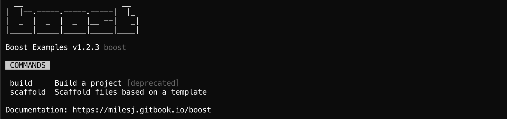
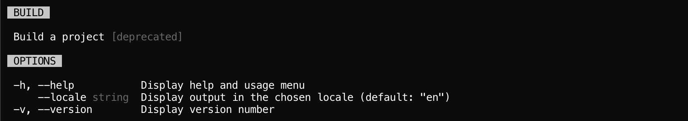
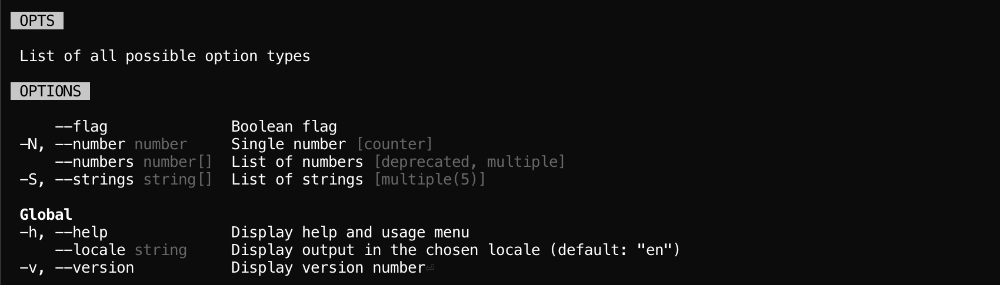
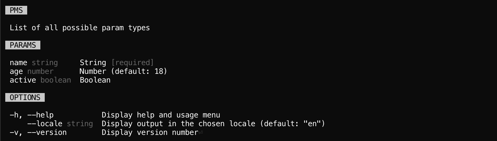
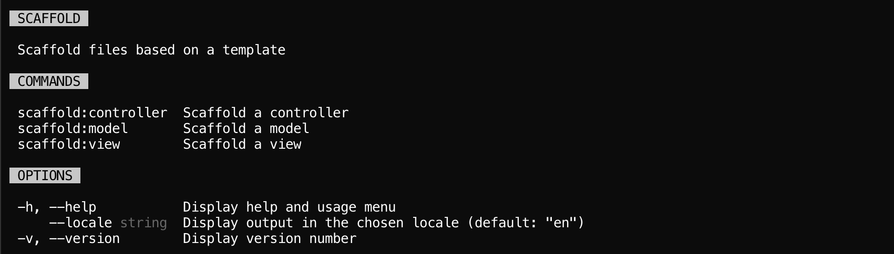

# CLI

A type-safe and interactive command line program, powered by [React][react] and [Ink][ink].

## Installation

```
yarn add @boost/cli react
```

## Events

| Event                                                  | Arguments                                            | Description                                                                |
| ------------------------------------------------------ | ---------------------------------------------------- | -------------------------------------------------------------------------- |
| `Command#onAfterRegister`, `Program#onAfterRegister`   | `path: CommandPath, command: Commadable`             | Called after a command has been registered.                                |
| `Command#onBeforeRegister`, `Program#onBeforeRegister` | `path: CommandPath, command: Commadable`             | Called before a command has been registered.                               |
| `Program#onAfterRender`                                |                                                      | Called after a component has rendered.                                     |
| `Program#onAfterRun`                                   | `error?: Error`                                      | Called after the program and command have been ran.                        |
| `Program#onBeforeRender`                               | `result: RunResult`                                  | Called after a command has run but before a component will render.         |
| `Program#onBeforeRun`                                  | `argv: Argv`                                         | Called before the program and command will run.                            |
| `Program#onCommandFound`                               | `argv: Argv, path: CommandPath, command: Commadable` | Called when a command has been found after parsing argv.                   |
| `Program#onCommandNotFound`                            | `argv: Argv, path: CommandPath`                      | Called when a command wasn't found after parsing argv.                     |
| `Program#onExit`                                       | `message: string, code: number`                      | Called when the `exit()` handler is executed but before the process exits. |

## Usage

The CLI provides a simple object oriented framework for building and managing command line programs,
with clear separation of commands, middleware, args, a program instance, and more. It further
streamlines the development process by utilizing [Ink][ink] for terminal rendering, as manually
handling ANSI escape sequences and terminal widths can be tedious and complicated.

> The CLI makes heavy usage of the [args](./args.md) package, which will be continually referenced
> throughout this documentation. It's encouraged to read and understand it first.

### Program

The entry point of the command line is commonly referred to as the binary, or script, and is managed
by the `Program` class. This class handles the registration of commands, applying
[middleware](#middleware) to argv (`process.argv`), parsing argv into [arguments](./args.md#usage)
(options, flags, etc), running the found command with these argument, outputing to the terminal, and
finally cleaning up or handling failures.

Begin by importing and instantiating the `Program` class, while passing required and optional
options.

- `banner` (`string`) - A large banner to appear at the top of the index help interface.
  _(optional)_
- `bin` (`string`) - The name of the binary consumers enter on the command line. Must be in
  kebab-case.
- `footer` (`string`) - A string of text to display at the bottom of the index help interface.
  _(optional)_
- `header` (`string`) - A string of text to display at the top of the index help interface, below
  the banner (if present). _(optional)_
- `name` (`string`) - A human readable name for your program.
- `version` (`string`) - Current version of your CLI program. Typically the version found in your
  `package.json`. This is output when `--version` is passed.

```ts
import { Program } from '@boost/cli';
import pkg from './package.json';

const program = new Program({
  bin: 'boost',
  footer: 'Documentation: https://milesj.gitbook.io/boost',
  name: 'Boost Examples',
  version: pkg.version,
});
```



Once [commands](#commands) and optional [middleware](#middleware) have been registered, you must run
the program with `Program#run()` or `Program#runAndExit()`, with the latter automatically passing
the exit code to `process.exitCode`. Both methods require an argv list to run.

```ts
program.runAndExit(process.argv);
```

#### Package Integration

Now that you have the basics of a program, you can set the
[bin](https://docs.npmjs.com/files/package.json#bin) field in your `package.json`. This should point
to the program-aware file you have defined previously. For example, if my program will be called
`boost`.

```json
{
  "bin": {
    "boost": "./bin/boost.js"
  }
}
```

If you're writing your program in TypeScript, or non-Node compatible JavaScript, you'll need to
down-level compile before releasing your package. A simple alternative approach is to point your
binary file to where the compiled program would be found.

```js
// bin/boost.js
#!/usr/bin/env node

require('../lib/program.js');
```

#### Stand-alone

Boost offers 2 implementations for how the binary can be executed, the 1st is known as a stand-alone
program. This implementation only supports 1 [command](#commands) known as the default command,
which is immediately ran when the binary is. It does not support sub-commands.

To create a stand-alone binary, create and instantiate a command, then pass it to
`Command#default()`. The command's `path` is ignored for this situation.

```ts
import { Program } from '@boost/cli';
import StandAloneCommand from './commands/StandAloneCommand';

const program = new Program({
  // ...
});

program.default(new StandAloneCommand()).runAndExit(process.argv);
```

> Some good examples of stand-alone binaries are `babel`, `webpack`, and `tsc`.

#### Multi-command

The 2nd implementation is opposite the stand-alone program, and is known as a multi-command program.
When the binary is ran, and no arguments are passed, a help menu is displayed instead of executing
the default command. Otherwise, if arguments _are_ passed, a registered command will be ran based on
matching path name.

To create a multi-command binary, create and instantiate multiple commands, and pass them all to
`Command#register`. In the example below, the `boost` binary would support the `boost install`,
`boost uninstall`, and `boost build` commands.

```ts
import { Program } from '@boost/cli';
import InstallCommand from './commands/InstallCommand';
import UninstallCommand from './commands/UninstallCommand';
import BuildCommand from './commands/BuildCommand';

const program = new Program({
  // ...
});

program
  .register(new InstallCommand())
  .register(new UninstallCommand())
  .register(new BuildCommand())
  .runAndExit(process.argv);
```

> Some good examples of stand-alone binaries are `npm`, `yarn`, and `docker`.

#### Middleware

Boost will parse provided argv (a list of string arguments, typically from `process.argv`) into
[args][args] (an object of options, flags, params, etc) for easier consumption. This process can be
intercepted with `Program#middleware()`, which allows both argv and args to be read and mutated.

Middleware is a function, that receives the argv list as the 1st argument, and a parse callback as
the 2nd argument. It _must_ return an args object, which can be built by executing the parse
callback. This allows both before, middle, and after implementations to be possible, as demonstrated
below.

```ts
import { Program, Middleware } from '@boost/cli';

const example: Middleware = (argv, parse) => {
  if (argv.includes('--help')) {
    argv.push('--all');
  }

  return parse();
};

const program = new Program({
  // ...
});

program
  // Function reference
  .middleware(example)
  // Inline async function
  .middleware(async (argv, parse) => {
    const args = await parse();

    args.options.flag = true;

    return args;
  })
  .runAndExit(process.argv);
```

Middleware is async, so the parse callback _must be_ awaited! This also means you can implement your
own async functionality, like file system access, or network requests.

### Commands

Commands are self-encapsulated pieces of business logic that are ran when a matching path (a unique
argument) is found on the command line. To create a command, import and extend the abstract
`Command` class, and implement a `run()` method. This method can be async and even render
[React components](#rendering-components)!

```ts
import { Command } from '@boost/cli';

export default class BuildCommand extends Command {
  async run() {
    this.log('Starting process...');

    await runHeavyAsyncProcess();

    this.log('Process finished!');
  }
}
```

However, that's not all required, as a command and it's features must be configured! Features may be
defined with a declarative approach using TypeScript decorators, or an imperative approach with
static class properties. Both variants will be demonstrated in the examples below.

#### Config

All commands support the following metadata configuration, with `path` and `description` being
mandatory.

- `aliases` (`string[]`) - A list of aliased paths. Will not show up in the help menu, but will
  match on the command line.
- `allowUnknownOptions` (`boolean`) - Allow [unknown options](./args.md#unknown-options) to be
  parsed, otherwise an error is thrown. Defaults to `false`.
- `allowVariadicParams` (`boolean`) - Allow [variadic params](./args.md#variadic-params) to be
  parsed, otherwise an error is thrown. Defaults to `false`.
- `categories` (`object`) - A mapping of sub-command and option [categories](#categories) for this
  command only. [Global options](#global-options) are automatically defined under the `global`
  category.
- `category` (`string`) - The category this command belongs to. Will be used to group in the parent
  command or program. Defaults to no category.
- `deprecated` (`boolean`) - Whether the command is deprecated or not. Will display a tag in the
  help menu. Defaults to `false`.
- `description` (`string`) - A description of what the command is and does. Supports basic markdown
  for bold, italics, and underline. _(required)_
- `hidden` (`boolean`) - Whether the command should be hidden from the help menu or not. Will still
  match on the command line. Defaults to `false`.
- `path` (`string`) - A unique name in which to match the command on the command line amongst a list
  of arguments (argv). _(required)_
- `usage` (`string | string[]`) - Define one or many usage examples to display in the help menu.

When using decorators, import the `Config` decorator and apply it to the `Command` class. The path
and description are required, while all other metadata can be passed as an object.

```ts
import { Command, Config } from '@boost/cli';

@Config('build', 'Build a project', {
  aliases: ['make'],
  deprecated: true,
})
export default class BuildCommand extends Command {}
```

Otherwise, just define static class properties of the same name!

```ts
import { Command } from '@boost/cli';

export default class BuildCommand extends Command {
  static path: string = 'build';

  static aliases: string[] = ['make'];

  static description: string = 'Build a project';

  static deprecated: boolean = true;
}
```



#### Options

[Options](./args.md#options) are optional arguments that accept a value on the command line. When a
command is ran, each option is set as a class property based on the matching command line value, or
the provided default value. Like configuration above, options can be defined declaratively or
imperatively, with option types being passed to the 1st `Command` generic slot.

There are 5 `Arg` decorators to choose from when defining options (in the example below), all of
which are defined on a class property, where the property name becomes the option name. For example,
a property of `save` would become the `--save` option. Depending on the decorator, they support many
[option settings](./args.md#options), excluding `type` and `description`, which are inferred, and
`default` which comes from the property value.

```ts
import { Command, Arg, GlobalOptions } from '@boost/cli';

interface CustomOptions extends GlobalOptions {
  flag: boolean;
  number: number;
  numbers: number[];
  string: string;
  strings: string[];
}

export default class CustomCommand extends Command<CustomOptions> {
  @Arg.Flag('Boolean flag')
  flag: boolean = false;

  @Arg.Number('Single number', { count: true, short: 'N' })
  number: number = 0;

  @Arg.Numbers('List of numbers', { deprecated: true })
  numbers: number[] = [];

  @Arg.String('Single string', { choices: ['a', 'b', 'c'], hidden: true })
  string: string = '';

  @Arg.Strings('List of strings', { arity: 5, short: 'S' })
  strings: string[] = [];

  run() {
    const { flag, strings } = this;
    // ...
  }
}
```

If you prefer to use static properties, all options are defined through the single static `options`
property, which requires a mapping of option names to [option settings](./args.md#options). With
this approach, `type` and `description` are required, with `default` either being configured with a
setting, or coming from the class property value.

For easier type safety, the `Options` collection type can be used to type the static property.

```ts
import { Command, GlobalOptions, Options } from '@boost/cli';

interface CustomOptions extends GlobalOptions {
  flag: boolean;
  number: number;
  numbers: number[];
  string: string;
  strings: string[];
}

export default class CustomCommand extends Command<CustomOptions> {
  static options: Options<CustomOptions> = {
    flag: {
      description: 'Boolean flag',
      type: 'boolean',
    },
    number: {
      count: true,
      description: 'Single number',
      short: 'N',
      type: 'number',
    },
    numbers: {
      deprecated: true,
      description: 'List of numbers',
      multiple: true,
      type: 'number',
    },
    string: {
      choices: ['a', 'b', 'c'],
      description: 'Single string',
      hidden: true,
      type: 'string',
    },
    strings: {
      arity: 5,
      description: 'List of strings',
      multiple: true,
      short: 'S',
      type: 'string',
    },
  };

  flag: boolean = false;

  number: number = 0;

  numbers: number[] = [];

  string: string = '';

  strings: string[] = [];

  run() {
    const { flag, strings } = this;
    // ...
  }
}
```



##### Unknown Options

By default, unknown options are not allowed and will throw an error. To allow, set the
`allowUnknownOptions` [configuration setting](#config) to true. When enabled, all unknown options
will be set as a string object to the `Command#unknown` class property.

```ts
import { Command, GlobalOptions, Options } from '@boost/cli';

export default class CustomCommand extends Command<GlobalOptions> {
  static allowUnknownOptions = true;

  run() {
    const { foo, bar } = this.unknown;
    // ...
  }
}
```


##### Global Options

Boost provides the follow options that are always available to all commands.

- `--help`, `-h` (`boolean`) - Displays a help menu for the chosen command or the program itself.
  Available under the `help` class property.
- `--locale` (`string`) - Display errors, messages, and the interface in the chosen locale (if
  supported). Locale must be in the format of "en" or "en-US". Available under the `locale` class
  property.
- `--version`, `-v` (`boolean`) - Display the current program version and exit. Available under the
  `version` class property.

#### Params

[Params](./args.md#params) are command line values that will be passed to `Command#run()` as
arguments. When defining params, all [param settings](./args.md#params) are supported, and required
are mandatory. Param types are passed to the 2nd `Command` generic slot.

When using decorators, the `Arg.Params` decorator must be defined on the `Command#run()` method. It
accepts an argument for each param you want to configure, in the order they should be expected.

```ts
import { Command, Arg, GlobalOptions } from '@boost/cli';

type CustomParams = [string, number];

export default class CustomCommand extends Command<GlobalOptions, CustomParams> {
  @Arg.Params<CustomParams>(
    {
      description: 'String',
      label: 'name',
      required: true,
      type: 'string',
    },
    {
      default: 18,
      description: 'Number',
      label: 'age',
      type: 'number',
    },
    {
      description: 'Boolean',
      label: 'active',
      type: 'boolean',
    },
  )
  run(name: string, age: number, active: boolean) {
    // ...
  }
}
```

If you prefer to use static properties, all params are defined through the single static `params`
property, which requires an array of [param settings](./args.md#params).

For easier type safety, the `Params` collection type can be used to type the static property.

```ts
import { Command, Params, GlobalOptions } from '@boost/cli';

type CustomParams = [string, number];

export default class CustomCommand extends Command<GlobalOptions, CustomParams> {
  static params: Params<CustomParams> = [
    {
      description: 'String',
      label: 'name',
      required: true,
      type: 'string',
    },
    {
      default: 18,
      description: 'Number',
      label: 'age',
      type: 'number',
    },
    {
      description: 'Boolean',
      label: 'active',
      type: 'boolean',
    },
  ];

  run(name: string, age: number, active: boolean) {
    // ...
  }
}
```



##### Variadic Params

By default, variadic params are not enabled and will throw an error when an unconfigured param is
found. To allow, set the `allowVariadicParams` [configuration setting](#config) to true. When
enabled, all extra params will spread onto the end of the `Command#run()` method as strings.

Using the example above, it would look like the following.

```ts
import { Command, Params, GlobalOptions } from '@boost/cli';

type CustomParams = [string, number];

export default class CustomCommand extends Command<GlobalOptions, CustomParams> {
  static allowVariadicParams = true;

  static params: Params<CustomParams> = [
    // ...
  ];

  run(name: string, age: number, active: boolean, ...params: string[]) {
    // ...
  }
}
```


#### Rest Arguments

[Rest arguments](./args.md#rest) are all arguments that come after a standalone `--` delimiter, and
can be accessed using the `Command#rest` property, which is an array of strings.

#### Sub-commands

Of course commands can register their own commands, known as sub-commands -- it's commands all the
way down! Sub-commands are configured exactly the same, with the key difference being that their
path must be prefixed with their parent command's path, separated by a colon.

For example, say we have a scaffolding command, where each sub-command is the specific template to
generate. The parent path would be `scaffold`, where a child would be `scaffold:model`,
`scaffond:controller`, so on and so forth. You can see this in action below.

```ts
import { Command, Config } from '@boost/cli';

@Config('scaffold:controller', 'Scaffold a controller')
class ScaffoldControllerCommand extends Command {}

@Config('scaffold:model', 'Scaffold a model')
class ScaffoldModelCommand extends Command {}

@Config('scaffold', 'Scaffold a template')
class ScaffoldCommand extends Command {
  constructor() {
    super();

    this.register(new ScaffoldControllerCommand());
    this.register(new ScaffoldModelCommand());
  }
}
```

Sub-commands can now be executed on the command line by passing their full path, like so:
`boost scaffold:model --name User`.



#### Rendering Components

TODO

### Shorthand Commands

Sometimes classes may be overkill for commands, so Boost offers a feature known as shorthand
commands, where only objects and functions are used. To utilize shorthand commands, call either the
`Program#register()` or `Command#register()` methods, with a unique path, settings object (config,
options, params, etc)), and run function.

```ts
interface BuildOptions {
  minify: boolean;
}

type BuildParams = [string];

program.register<BuildOptions, BuildParams>(
  'build',
  {
    description: 'Build a project',
    options: {
      minify: { description: 'Minify source files', type: 'boolean' },
    },
    params: [
      { description: 'Name of project', label: 'name', type: 'string' }
    ]
  },
  function build(options: BuildOptions, params: BuildParams, rest: string[]) => {
    // ...
  },
);
```

Besides a different API, the arguments to the run function are also different. Instead of spread
params like in a class, they are an options object, list of params, and list of rest arguments
respectively.

> If you want to access the [logger](#logging), be sure to use a function declaration instead of an
> anonymous function, so that context binding works correctly!

### Categories

Categories are a mechanism for grouping commands and options in the help menu for easier
readability. They're shared between both commands and options for interoperability purposes, and can
be defined globally with `Program#categories()`, or per command through
[`categories` configuration](#config). To make use of categories, define a mapping of keys to
category names and optional weights, like so.

```ts
program.categories({
  // Explicit weight
  cache: {
    name: 'Caching',
    weight: 60,
  },

  // Automatic weight
  error: 'Error handling',
});
```

```ts
import { Command, Categories } from '@boost/cli';

class CustomCommand extends Command {
  static categories: Categories = {
    cache: {
      name: 'Caching',
      weight: 60,
    },
    error: 'Error handling',
  };
}
```

Categories are sorted by weight first, then alphabetical second, so define `weight` when you want
strict control of the category order. Uncategorized items have a weight of `0`, and the built-in
globals have a weight of `100`.

Now that categories have been defined, be sure to set the category on your commands and options
using the `category` setting! Here's an example using decorators.

```ts
import { Command, Config, Arg } from '@boost/cli';

@Config('build', 'Build a project', { category: 'build' })
export default class BuildCommand extends Command {
  @Arg.Flag('Write output to cache', { category: 'cache' })
  cache: boolean = false;
}
```

### Logging

Boost integrates its very own [logger](./log.md) so that logs can easily be sent to the configured
`stdout` and `stderr`. The logger is accessible using `Command#log()` and associated methods.

```ts
import { Command } from '@boost/cli';

class CustomCommand extends Command {
  run() {
    this.log('Normal log');
    this.log.error('Failed log');
    this.log.debug('Debug log');
    // ...
  }
}
```

The logger is also accessible within a component by using the `ProgramContext`, like so.

```tsx
import React, { useContext } from 'react';
import { Box, ProgramContext } from '@boost/cli';

function CustomComponent() {
  const { log } = useContext(ProgramContext);

  log('Normal log');
  log.error('Failed log');
  log.debug('Debug log');
  // ...

  return <Box>Loading...</Box>;
}
```

> It's highly encouraged to use this logging layer instead of the native console, so that logged
> messages do not interrupt any React rendering process!

### Themes

Themes are a feature that will be enabled in v2. Please come back soon!

## Components

Boost provides the following components for use within your programs.

### Ink

Since Boost is built on Ink, we had to implement our own abstraction around it for the CLI to
operate properly. Because of this, not all Ink components can be used, except for the following.

- [Box](https://github.com/vadimdemedes/ink#box)
- [Color](https://github.com/vadimdemedes/ink#color)
- [Text](https://github.com/vadimdemedes/ink#text)

For convenience, these components can be imported from the Boost CLI package. This is preferred so
that your usage of these components stay in sync with the version we expect.

```tsx
import { Box } from '@boost/cli';

<Box padding={1}>Loading data...</Box>;
```

### Style

The `Style` component is special in that it renders and applies colors based on the
[chosen theme](#themes). It accomplishes this through the `type` prop, which accepts one of the
theme palette names.

```tsx
import { Style } from '@boost/cli';

<Style type="success">Downloaded 123 packages</Style>;
```

Furthermore, it also supports text styling similar to Ink's `Text` component. This uses
[chalk](https://www.npmjs.com/package/chalk) under the hood.

```tsx
<Style bold type="failure">
  Faild to download packages
</Style>
```

> It's highly encouraged to use this component for all color based styling, so that consumers can
> always use their chosen theme!

### Header

The `Header` component is simply that, a header! It renders an inverted background, with bold and
uppercased text, and appropriate margins. It's what the [help](#help) and [failure](#failure) menus
use to separate and denote sections.

```tsx
import { Header } from '@boost/cli';

<Header label="About" />;
```

Headers can also be [styled](#style) by providing a `type` prop, which will color the background.

### Help

The `Help` component can be used to render elegant command usage and help menus. It's a very complex
component that supports everything from command metadata to variadic params, all through the
following props (all optional).

- `categories` (`{ [name: string]: Category }`) - Mapping of [categories](#categories) to use for
  command and option grouping.
- `config` (`CommandConfig`) - [Configuration](#config) metadata about the current command.
- `commands` (`{ [path: string]: CommandConfig }`) - Mapping of [commands](#sub-commands), typically
  sub-commands.
- `header` (`string`) - A [header](#header) to display at the top of the output.
- `options` (`{ [name: string]: OptionConfig }`) - Mapping of [options](#options).
- `params` (`ParamConfig[]`) - List of [params](#params).

```tsx
import { Help } from '@boost/cli';

<Help
  header="Info"
  config={{ description: 'This is a very cool program', deprecated: true }}
  params={[
    {
      description: 'Name',
      type: 'string',
    },
  ]}
/>;
```

### Failure

The `Failure` component can be used to render a beautiful failure menu, for an error and its stack
trace. The `error` prop must be provided with an `Error` instance. An optional `warnings` prop can
be provided with a list of `Error`s, for displaying minor issues without a stack trace.

```tsx
import { Failure } from '@boost/cli';

<Failure error={new Error('Something is broken!')} />;
```

[args]: https://www.npmjs.com/package/@boost/args
[ink]: https://github.com/vadimdemedes/ink
[react]: https://reactjs.org/
